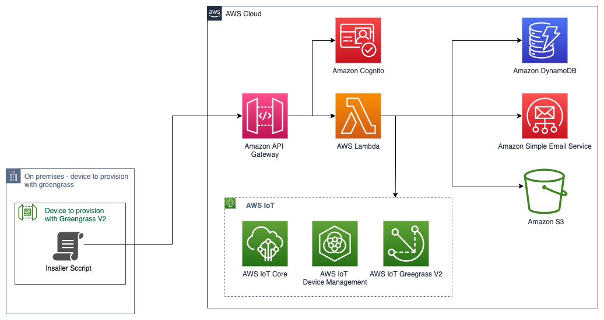
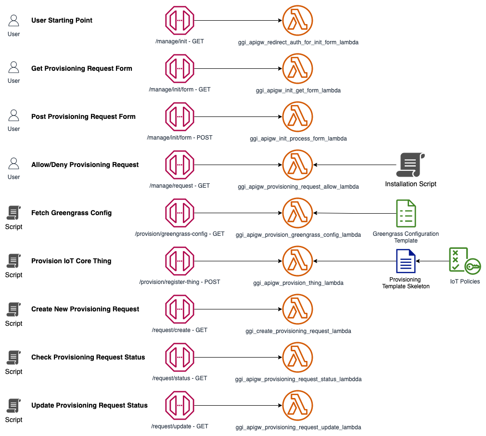

# Welcome to the Greengrass V2 Installation application

## Overview
This solution allows installing Greengrass V2 on an edge gateway without requiring access to the AWS Account
where the device will connect. The User supervising the installation only needs to be able to authenticate
with Amazon Cognito in order to initiate the installation process. No specific knowledge of the AWS Cloud nor
Greengrass is necessary.

## Architecture diagram

### API Endpoints

## Flow Diagram

* The User triggers a new provisioning by filling a form after auhentication.
* In response to the form the user receives a short-lived pre-signed URL to a script stored in an S3 bucket.
This script is customised for this provisioning and contains a ime-limited access token to interact with the API.
* The User downloads and runs this script on the device
* The script registers the star of the provisioning to the backend and waits for approval by the User (second factor authentication)
* The User receives an email with an 'allow' and a 'deny' link.
* If the provisioning is denied, the script ends there. If approved it continues.
* The script:
  * Downloads Greengrass V2 installation archive.
  * Generates the secrets and a CSR locally
  * Contacts the backend for registering an IoT Thing and signing the CSR
  * Stores locally the signed certificate received in the response
  * Fetches a Greengrass Configuration Template from the backend. This template has been customised by the backend 
with cloud-side information.
  * Finish customising the Greengrass Configuration Template with local information.
  * Runs the Greengrass installer
  * Et voilà!

## Planned features
* Make this project deployable from CDK.
* Add possibility to deploy an application to Greengrass after installation.

## Limitations

