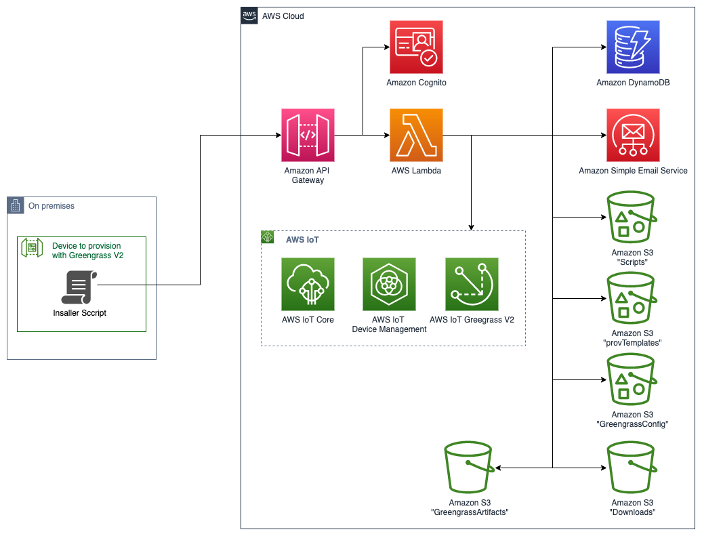

# Welcome to the Greengrass V2 Installation application

## Overview
This solution allows installing Greengrass V2 on an edge gateway without requiring access to the AWS Account
where the device will connect. The User supervising the installation only needs to be able to authenticate
with Amazon Cognito in order to initiate the installation process. No specific knowledge of the AWS Cloud nor
Greengrass is necessary.

## Architecture diagram

### API Endpoints


## Flow Diagram


* The User triggers a new provisioning by filling a form after authentication.
* In response to the form the user receives a short-lived pre-signed URL to a script stored in an S3 bucket.
This script is customised for this provisioning and contains a ime-limited access token to interact with the API.
* The User downloads and runs this script on the device
* The script registers the star of the provisioning to the backend and waits for approval by the User (second factor authentication)
* The User receives an email with an 'allow' and a 'deny' link.
* If the provisioning is denied, the script ends there. If approved it continues.
* The script:
  * Downloads Greengrass V2 installation archive.
  * Generates the secrets and a CSR locally
  * Contacts the backend for registering an IoT Thing and signing the CSR
  * Stores locally the signed certificate received in the response
  * Fetches a Greengrass Configuration Template from the backend. This template has been customised by the backend 
with cloud-side information.
  * Finish customising the Greengrass Configuration Template with local information.
  * Runs the Greengrass installer
  * Et voilà!

## Installation

This application should be deployed using the AWS Cloud Development Kit (AWS CDK).
The CDK Stack has been written in Python 3 to stay consistent with the application language.
In a nutshell, after installing a stable version of Node.js:


```bash
npm install -g aws-cdk
pip3 install -r requirements.txt
cdk deploy
```


In addition to providing the account ID, region and credentials to CDK, 
you will have to declare two environment variables:
* COGNITO_DOMAIN_PREFIX: a unique URL prefix for teh cognito domain, like cognito-123456
* SES_VERIFIED_EMAIL: the verified email address that SES will use to send emails. You'll receive an email for 
  verifying this address, so make sure you can access the mailbox.

SES will be in Sandbox mode. Provisioning will fail until you take one of the actions described in the following 
documentation:
https://docs.aws.amazon.com/ses/latest/dg/request-production-access.html

Once deployed:
* Create users in Cognito
* Add them to the User Group created by the CDK (by default: GreengrassProvisioningOperators)
* Make sure to verify the Users email

## Usage
All you have to do is:

1. Note the Output, provided by the CDK deployment, giving you the URL of API Gateway.
2. Hit this URL with the endpoint /manage/init/ 
    (for instance https://xlevm4nzib.execute-api.eu-central-1.amazonaws.com/prod/manage/init)
3. Follow the instructions

## Good to know
Five buckets are deployed by CDK:

* **Scripts**: This is where the script installing Greegrass on the device is located. You can add customized scripts
  to this Bucket and if their extension is `.py` they will be listed as options in the selection form.
* **provTemplate**: This is where the IoT Provisioning Template is stored. Tou can add customized templates
  to this Bucket and if their extension is `.json` they will be listed as options in the selection form.
* **GreengrassConfig**: This is where the IoT Greengrass Configuration File is stored. Tou can add customized configurations
  to this Bucket and if their extension is `.yaml` they will be listed as options in the selection form.
* **GreengrassArtifacts**: This Bucket is empty. It is where the deployable Greegrass artifacts should be stored. This
  Bucket is created at this time to be able to set read access to the Greegrass devices.
* **Downloads**: This is where the installations script is stored after being customised. It is then downloaded manually
  with a pre-signed URL provided to you in the process.

Bear in mind that CDK will customise the above Bucket names to make them unique. So you'll have to 
interpret what you read!

An Amazon DynamoDB Table tracks installations and their details.

Logs are enabled by default.

## Planned features

* Add possibility to deploy an application to Greengrass after installation.

## Limitations

* Only Linux devices are supported.


